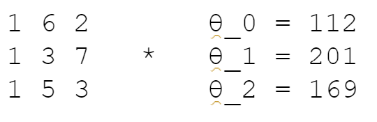
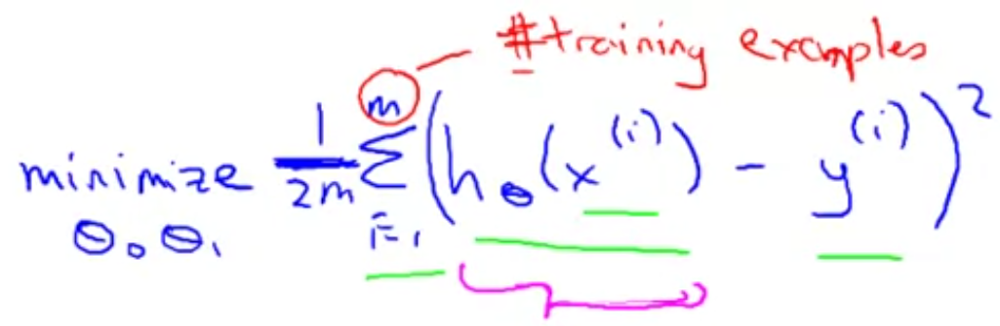
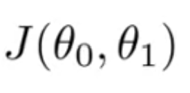
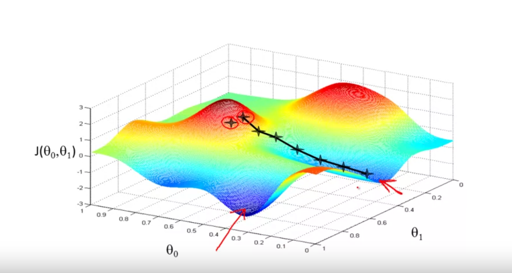
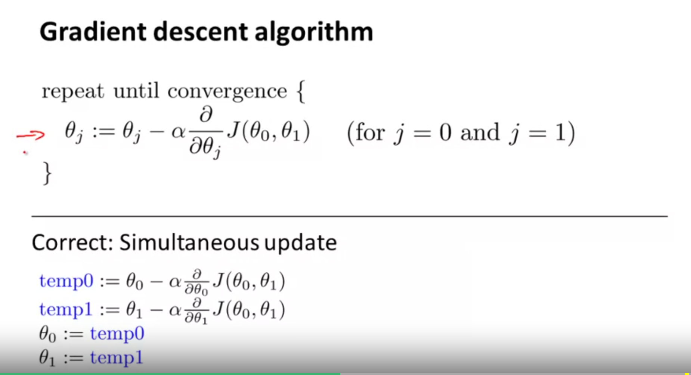
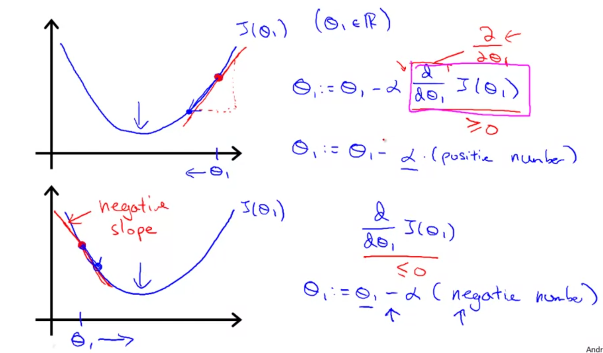
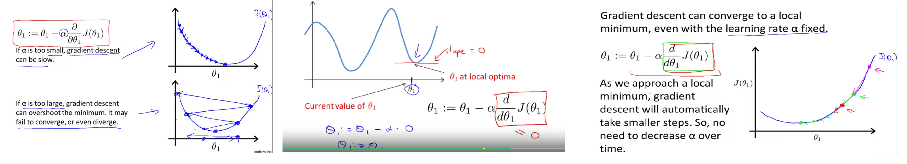
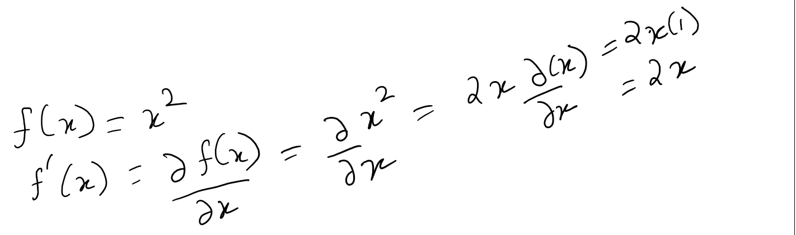
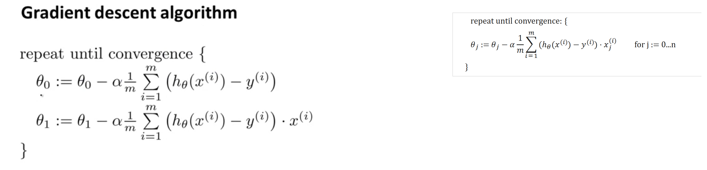

Terminology/vocabulary: prediction, Features(input vars), labels(output/target var), hypothesis function, objective/cost/loss function, optimization function, classification: prediction of discrete label values (if labels are strings, we encode them as numbers for ML), regression: prediction of continuous numeric label values, clustering: we find clusters/groupings in the data such that data in each cluster is cohesive in some sense.

Traditional mathematical modeling starts with a equation and then tries to tune the parameters/coefficients
of the model to best fit the observed data. In ML 'modelling' we just use the data to make
predictions without creating an equation first. Some ML approaches like regression will output
the parameters/coefficients so that the mathematical equation can be created to explain the model whereas for others like neural networks the output can't be easily explained (or a mathematical equation created)

Linear equation for one feature:
y = f(x) = b + mx where b is intercept and m is slope(derivative/rate of change/gradient). These are the tuning parameters/coefficients we have to predict. This equation can also be written in ML parlance as:
H(x) = $θ_0 +θ_1*x$ where theta0 is intercept and theta1 is slope. And these parameters are what we have to find. Note that the number of parameters is 1 + the number of actual features. The extra added parameter is the intercept(also called bias in ML lingo) which we multiply by 1(dummy feature added to the dataset to be able to multiply the feature matrix with parameter vector). 

Note that this ML Bias(intercept parameter) is different from statistical bias(refer bias-variance tradeoff). Statistical bias refers to the error that the ML algo made predicting the labels over the input dataset. So the objective/cost functions SE/MSE/RMSE are actually measure Bias in statistical sense. One way to explain Bias-variance tradeoff is to try to fit a line to a input dataset. If the line is linear(hypothesis is linear), then it might underfit the data and hence we will get large bias(error). But if we try to fit a polynomial(of higher and higher order) to the data, then the error would keep decreasing but variance would increase as the polynomial would try to overfit data points (even the outliers) by varying wildly all over the problem space.

Linear equation for 3 features:
H(x) = $θ_0 +θ_1*x_1 +θ_2*x_2 +θ_3*x_3$ 

Now to do linear regression, we have the training data set which means we have values for features x1 to xN for different observations, the corresponding label values and we have to find the values of thetas. E.g.

$θ_0 +θ_1*x_{1,1} +θ_2*x_{1,2}$ = 112 

$θ_0 +θ_1*x_{2,1} +θ_2*x_{2,2}$ = 201 

$θ_0 +θ_1*x_{3,1} +θ_2*x_{3,2}$ = 169

Filling in the example feature values, it becomes:

$θ_0 +θ_1*6 +θ_2*2$ = 112

$θ_0 +θ_1*3 +θ_2*7$ = 201

$θ_0 +θ_1*5 +θ_2*3$ = 169

This system of linear equations can also be written as product of two matrices(we created a dummy feature with value 1 for all observations to be able to use matrix product):
{#id .class width=30% height=70%}

Now what we have is a system of linear equations. Why do we need Linear regression to solve this and why can't we use linear equation solver for the answer?? I think a solution has to exist if we have to use linear equation solver to get the result. A solution will exist if these 3 planes(lines in case of 2 dimensions. Here we have 3 dimensions and thus we have a plane for each equation and solution exists if the 3 planes intersect) intersect at a point. If they do not intersect, no solution exists. In that case, linear regression will still come up with the values of thetas/parameters/coefficients that minimize the loss/cost/objective function for all the training dataset(RMSE??). q


```{r}
#Try to solve using linear eq. solver
feature_matrix <- matrix(c(1,6,2,1,3,7,1,5,3),nrow=3,ncol=3,byrow = T)
#parameter_vector is what we have to find
label_vector = c(112,201,169)
parameter_vector <- solve(feature_matrix,label_vector)#this gives the value of thetas to be 782 -98 -41
library(matlib)
plotEqn3d(A=feature_matrix,b=label_vector)


#Test if these theta values do solve the system of linear equation.
feature_matrix%*%parameter_vector#this does the matrix multiplication to get the result which is same as the label vector

#this toy system shows the plane intersection clearly for 3-dimensional system of equations.
A <- matrix(c(13, -4, 2, -4, 11, -2, 2, -2, 8), 3,3)
b <- c(1,2,4)
plotEqn3d(A,b)

#now solve the above problem using linear regression
features_and_labels <- cbind(feature_matrix,label_vector)
features_and_labels <- as.data.frame(features_and_labels)#lm expects the features and labels in same dataframe. Note how we only passed in the the actual features (x1 and x2) and not the dummy x0 feature for the intercept but we do get the parameter/coefficient for it.
names(features_and_labels) <- c("x0","x1","x2","labels")
lm_obj <- lm(label_vector~x1+x2,features_and_labels)#this give the same output as linear equations solver.
# Coefficients:
# (Intercept)           x1           x2  
#         782          -98          -41


#TODO: Now come up with an example where the linear equation solver fails but linear regression succeeds. Lets take 2 parallel line and see what happens when we solve it using linear eq solver vs linear regression:


```

Squared error(SE) is calculated by taking the square of difference of prediction and the actual label value for every row in the training dataset and then summing it up. You can then take mean of it (dividing by number of rows in the training dataset) and then taking its root to get RMSE which scales down the value of SE.

Cost Function:
To measure the accuracy of the model we use a cost function.
{#id .class width=250 height=70px} 
In here we are taking the mean of SE and dividing it m. We also divide it by 2 to make the later math easier when we compute gradient descent as the 1/2 will cancel out the 2 from the derivative of squared error.

By convention, the cost function is called J. Thus, for a univariate(one feature) dataset, the cost function would be the following where theta0 is the parameter/intercept term (or the coefficient of the dummy feature with value 1) and theta1 is the parameter/coefficient of the only feature variable in the dataset.  

{#id .class width=7% height=70%}

Now how do we minimize the cost function? Cost function is simply telling you how well the model performed, nothing else.
We need some other smart logic to select the parameters/coefficients of the features such that the cost function is minimized. To visualize the problem, we can manually select different values of the theta parameters and then plot the cost. Now on that plot showing the cost function against the theta param values, we need to go in the direction where the cost is minimized. And that is what the smart parameter selection algos do, they go in the direction where cost is minimized. To recap till here: for prediction you want to come with hypothesis function which has some parameters that work on the feature variables to fit the data. To determine how well the model fits the data for some parameters, we use a objective /loss/cost func. And optimization function is the smart/heuristic logic that selects the params which minimize the objective func. Gradient descent is one optimization algo. There are other optmization algos as well, one such being Shuffled Complex Evolution(SCE) that i used to tune gr4j params. 


So we have to create a surface to visualize the parameter space and associated cost and set up the math to minimize the objective/loss function. Note that since in this example we have 2 parameters which we are minimizing, it means that we have a on feature dataset(the extra parameter is the intercept)
{#id .class width=29% height=70%}

{#id .class width=39% height=70%}
The alpha in the equation above is the learning rate(or step size) and each of the partial derivative  gives us the rate of change(or slope) of the loss function wrt to that parameter (in that direction). Term converge means that on further iterations, we are not able to minimize the solution further. 

Note: How does the -ve sign tells the algo to descend. The intuition behind is this: Lets say we are at a particular point on the cost function surface corresponding to param values theta0 and theta1 and we want to change theta0 such that we decrease the cost. For that we calculate the partial derivative of the cost function wrt theta0 which will give us the slope of the function at the point (theta0,theta1). If the slope is +ve, it means we have to decrease the value of theta0 to go downhill and if the the slope is -ve, it means we have to increase the value of theta0 to go downhill(-ve will cancle the -ve slope value and thus we will increase theta0). We have to do this for theta1 as well by taking the partial derivative of cost function wrt theta1 also.
{#id .class width=39% height=70%}
Regarding the step size(learning rate), it should be small value. Otherwise we will overshoot the minimum. But if too small, the algo will take a long time to converge. So u have to balance it. At the minimum, the slope/gradient/derivative/rateofchange would be zero(or near zero) in all the dimensions(i.e. wrt to all the parameters). Thus the stepsize*slope term value would be zero and thus the parameter values would not change on further iterations of the algo(convergence).
Note that the step size means by what value do you change the parameter and then multiplying it with slope gives you the change in the cost function for that change. So for a fixed change/stepsize of a parameter value, the greater the slope, the greater the change in the cost function. It works the other way as well. If the slope is constant, increasing/descreasing the stepsize of the parameter(learning rate) will control by how much change does the cost function changes. But that is just food for thought and we keep the stepsize (of the parameter(s)) constant.
{#id .class width=100% height=100%}

Now how do we calculate derivative to get the slope. In this case since there are two variable(theta0 and theta1), we have to calculate the partial derivative in terms of both varying one keeping other constant. The derivative of a constant term is zero(think about it. since it is a constant there is no change in it when we vary the variable wrt which we are calculating the derivative) and derivative of a variable wrt to itself is 1 as factor of change is one(think! when u change theta0, how much is the change in theta0. it is 1). Also, note that if f(x)=x^2, then its derivative is 2(x) computed as follows:
{#id .class width=40% height=50%}

Since there are 2 variables in the cost/objective function, we take the partial derivative of cost function wrt to both(turn by turn varying one and keeping other constant) to give us the slope of cost func. [derivative is slope]
{#id .class width=150% height=150%}
This gives us the slope of the cost functions wrt to different parameters which we can now back plug into the gradient descent algo. This version of Gradient descent is also called Batch Gradient Descent as it takes the complete batch of training dataset(all the m rows)
{#id .class width=30% height=40%}

Now how do we deal with the problem of gradient descent converging to local minimum (instead of the global minimum). Normally we would run the algo many times from different random starting points in the hope that it will descend to the global minimum. But for linear function we do not have to worry about gradient descent converging to a local minimum as the cost function for linear regression is convex and thus has only on minimum. Do not know why it is being called convex as the image conveys it is concave!

Note: above i had noted that the linear equations that do not have a solution cannot be solved using numerical methods. That is false. There exist numerical methods(noral equations method) that taken into account the cost function and thus can work towards achieving that goal instead of an explicit solution. For small datasets normal equations methods might be faster than gradient descent as gradient descent is iterative but gradient descent scales much better and for large datasets it is faster.