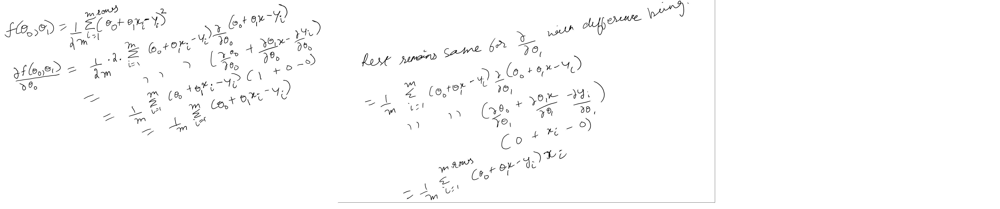
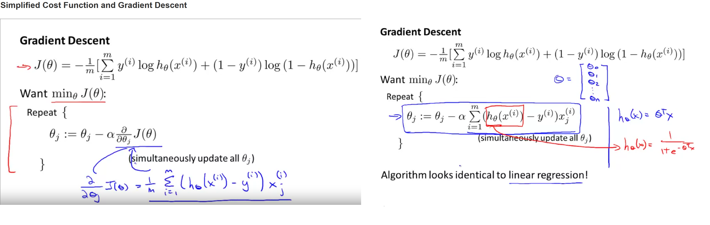

Terminology/vocabulary: prediction, Features(input vars), labels(output/target var), hypothesis function, objective/cost/loss function, optimization function, classification: prediction of discrete label values (if labels are strings, we encode them as numbers for ML), regression: prediction of continuous numeric label values, clustering: we find clusters/groupings in the data such that data in each cluster is cohesive in some sense. m is the number of rows in training dataset and n is the number of features(theta is no. of params and is n+1), regularization(shrinkage, penalty)

Traditional mathematical modeling starts with a equation and then tries to tune the parameters/coefficients
of the model to best fit the observed data. In ML 'modelling' we just use the data to make
predictions without creating an equation first. Some ML approaches like regression will output
the parameters/coefficients so that the mathematical equation can be created to explain the model whereas for others like neural networks the output can't be easily explained (or a mathematical equation created)

Linear equation for one feature:
y = f(x) = b + mx where b is intercept and m is slope(derivative/rate of change/gradient). These are the tuning parameters/coefficients we have to predict. This equation can also be written in ML parlance as:
H(x) = $θ_0 +θ_1*x$ where theta0 is intercept and theta1 is slope. And these parameters are what we have to find. Note that the number of parameters is 1 + the number of actual features. The extra added parameter is the intercept(also called bias in ML lingo) which we multiply by 1(dummy feature added to the dataset to be able to multiply the feature matrix with parameter vector). 

Note that this ML Bias(intercept parameter) is different from statistical bias(refer bias-variance tradeoff). Statistical bias refers to the error that the ML algo made predicting the labels over the input dataset. So the objective/cost functions SE/MSE/RMSE are actually measure Bias in statistical sense. One way to explain Bias-variance tradeoff is to try to fit a line to a input dataset. If the line is linear(hypothesis is linear), then it might underfit the data and hence we will get large bias(error). But if we try to fit a polynomial(of higher and higher order) to the data, then the error would keep decreasing but variance would increase as the polynomial would try to overfit data points (even the outliers) by varying wildly all over the problem space.

{#id .class width=100% height=70%} Todo:The error here being considered is the for unseen data (non-training data)??


Linear equation for 3 features:
H(x) = $θ_0 +θ_1*x_1 +θ_2*x_2 +θ_3*x_3$ 

Now to do linear regression, we have the training data set which means we have values for features x1 to xN for different observations, the corresponding label values and we have to find the values of thetas. E.g.

$θ_0 +θ_1*x_{1,1} +θ_2*x_{1,2}$ = 112 

$θ_0 +θ_1*x_{2,1} +θ_2*x_{2,2}$ = 201 

$θ_0 +θ_1*x_{3,1} +θ_2*x_{3,2}$ = 169

Filling in the example feature values, it becomes:

$θ_0 +θ_1*6 +θ_2*2$ = 112

$θ_0 +θ_1*3 +θ_2*7$ = 201

$θ_0 +θ_1*5 +θ_2*3$ = 169

This system of linear equations can also be written as product of two matrices(we created a dummy feature with value 1 for all observations to be able to use matrix product):
{#id .class width=30% height=70%}

Now what we have is a system of linear equations. Why do we need Linear regression to solve this and why can't we use linear equation solver for the answer?? I think a solution has to exist if we have to use linear equation solver to get the result. A solution will exist if these 3 planes(lines in case of 2 dimensions. Here we have 3 dimensions and thus we have a plane for each equation and solution exists if the 3 planes intersect) intersect at a point. If they do not intersect, no solution exists. In that case, linear regression will still come up with the values of thetas/parameters/coefficients that minimize the loss/cost/objective function for all the training dataset(RMSE??). q


```{r}
#Try to solve using linear eq. solver
feature_matrix <- matrix(c(1,6,2,1,3,7,1,5,3),nrow=3,ncol=3,byrow = T)
#parameter_vector is what we have to find
label_vector = c(112,201,169)
parameter_vector <- solve(feature_matrix,label_vector)#this gives the value of thetas to be 782 -98 -41
library(matlib)
plotEqn3d(A=feature_matrix,b=label_vector)


#Test if these theta values do solve the system of linear equation.
feature_matrix%*%parameter_vector#this does the matrix multiplication to get the result which is same as the label vector

#this toy system shows the plane intersection clearly for 3-dimensional system of equations.
A <- matrix(c(13, -4, 2, -4, 11, -2, 2, -2, 8), 3,3)
b <- c(1,2,4)
plotEqn3d(A,b)

#now solve the above problem using linear regression
features_and_labels <- cbind(feature_matrix,label_vector)
features_and_labels <- as.data.frame(features_and_labels)#lm expects the features and labels in same dataframe. Note how we only passed in the the actual features (x1 and x2) and not the dummy x0 feature for the intercept but we do get the parameter/coefficient for it.
names(features_and_labels) <- c("x0","x1","x2","labels")
lm_obj <- lm(label_vector~x1+x2,features_and_labels)#this give the same output as linear equations solver.
# Coefficients:
# (Intercept)           x1           x2  
#         782          -98          -41


#TODO: Now come up with an example where the linear equation solver fails but linear regression succeeds. Lets take 2 parallel line and see what happens when we solve it using linear eq solver vs linear regression:


```

Squared error(SE) is calculated by taking the square of difference of prediction and the actual label value for every row in the training dataset and then summing it up. You can then take mean of it (dividing by number of rows in the training dataset) and then taking its root to get RMSE which scales down the value of SE.

Cost Function:
To measure the accuracy of the model we use a cost function.
{#id .class width=250 height=70px} 
In here we are taking the mean of SE and dividing it m. We also divide it by 2 to make the later math easier when we compute gradient descent as the 1/2 will cancel out the 2 from the derivative of squared error.

By convention, the cost function is called J. Thus, for a univariate(one feature) dataset, the cost function would be the following where theta0 is the parameter/intercept term (or the coefficient of the dummy feature with value 1) and theta1 is the parameter/coefficient of the only feature variable in the dataset.  

{#id .class width=7% height=70%}

Now how do we minimize the cost function? Cost function is simply telling you how well the model performed, nothing else.
We need some other smart logic to select the parameters/coefficients of the features such that the cost function is minimized. To visualize the problem, we can manually select different values of the theta parameters and then plot the cost. Now on that plot showing the cost function against the theta param values, we need to go in the direction where the cost is minimized. And that is what the smart parameter selection algos do, they go in the direction where cost is minimized. To recap till here: for prediction you want to come with hypothesis function which has some parameters that work on the feature variables to fit the data. To determine how well the model fits the data for some parameters, we use a objective /loss/cost func. And optimization function is the smart/heuristic logic that selects the params which minimize the objective func. Gradient descent is one optimization algo. There are other optmization algos as well, one such being Shuffled Complex Evolution(SCE) that i used to tune gr4j params. 


So we have to create a surface to visualize the parameter space and associated cost and set up the math to minimize the objective/loss function. Note that since in this example we have 2 parameters which we are minimizing, it means that we have a on feature dataset(the extra parameter is the intercept)
{#id .class width=29% height=70%}

{#id .class width=39% height=70%}
The alpha in the equation above is the learning rate(or step size) and each of the partial derivative  gives us the rate of change(or slope/gradient) of the loss function wrt to that parameter (in that direction). Term converge means that on further iterations, we are not able to minimize the solution further. A function would be at its minimum (converged) when the slope/gradient/partial derivatives wrt thetas/params is 0. We can also define tolerance for the optimization algo. If the slope/partial derivatives wrt thetas/gradient is very near to 0, thus making very small changes in thetas (those very small changes<tolerance), we can say that solution has converged.  

Note: How does the -ve sign tells the algo to descend. The intuition behind is this: Lets say we are at a particular point on the cost function surface corresponding to param values theta0 and theta1 and we want to change theta0 such that we decrease the cost. For that we calculate the partial derivative of the cost function wrt theta0 which will give us the slope of the function at the point (theta0,theta1). If the slope is +ve, it means we have to decrease the value of theta0 to go downhill and if the the slope is -ve, it means we have to increase the value of theta0 to go downhill(-ve will cancle the -ve slope value and thus we will increase theta0). We have to do this for theta1 as well by taking the partial derivative of cost function wrt theta1 also.
{#id .class width=39% height=70%}
Regarding the step size(learning rate), it should be small value. Otherwise we will overshoot the minimum. But if too small, the algo will take a long time to converge. So u have to balance it. At the minimum, the slope/gradient/derivative/rateofchange would be zero(or near zero) in all the dimensions(i.e. wrt to all the parameters). Thus the stepsize*slope term value would be zero and thus the parameter values would not change on further iterations of the algo(convergence).
Note that the step size means by what value do you change the parameter and then multiplying it with slope gives you the change in the cost function for that change. So for a fixed change/stepsize of a parameter value, the greater the slope, the greater the change in the cost function. It works the other way as well. If the slope is constant, increasing/descreasing the stepsize of the parameter(learning rate) will control by how much change does the cost function changes. But that is just food for thought and we keep the stepsize (of the parameter(s)) constant.
{#id .class width=100% height=100%}

Now how do we calculate derivative to get the slope. In this case since there are two variable(theta0 and theta1), we have to calculate the partial derivative in terms of both varying one keeping other constant. The derivative of a constant term is zero(think about it. since it is a constant there is no change in it when we vary the variable wrt which we are calculating the derivative) and derivative of a variable wrt to itself is 1 as factor of change is one(think! when u change theta0, how much is the change in theta0. it is 1). Also, note that if f(x)=x^2, then its derivative is 2(x) computed as follows:
{#id .class width=40% height=50%}

Since there are 2 variables in the cost/objective function, we take the partial derivative of cost function wrt to both(turn by turn varying one and keeping other constant) to give us the slope of cost func. [derivative is slope]
{#id .class width=150% height=150%}
This gives us the slope of the cost functions wrt to different parameters which we can now back plug into the gradient descent algo. This version of Gradient descent is also called Batch Gradient Descent as it takes the complete batch of training dataset(all the m rows). Note that since we have added a dummy feature with value 1, we can generalize the two eq.s to be one parameterized such that we can loop over it(loop will run for the total number of thetas) with x0 being 1. This will also account for any number of features as well.
{#id .class width=90% height=40%}

Now how do we deal with the problem of gradient descent converging to local minimum (instead of the global minimum). Normally we would run the algo many times from different random starting points in the hope that it will descend to the global minimum. But for linear function we do not have to worry about gradient descent converging to a local minimum as the cost function for linear regression is convex and thus has only on minimum. So if we take a small learning rate/stepsize, gradient descent will eventually converge. TODO:Do not know why it is being called convex as the image conveys it is concave.! It is being called convex as it is convex downwards (and concave upwards)
{#id .class width=30% height=40%}

Note: above i had noted that the linear equations that do not have a solution cannot be solved using numerical methods. That is false. There exist numerical methods(normal equations method) that taken into account the cost function and thus can work towards achieving that goal instead of an explicit solution. For small datasets normal equations methods might be faster than gradient descent as gradient descent is iterative but gradient descent scales much better and for large datasets it is faster. TODO: Aren't numerical methods also iterative methods?? Yes, but this Normal equation method is not iterative. It solves for theta in one step. Refer:https://mathworld.wolfram.com/NormalEquation.html. Also, to note that there is no need to do feature scaling in normal equations method(which we do for grad descent)
{#id .class width=30% height=40%}

Diff bw Hyperparameters and parameters: parameters are 'learned' by the ML algo whereas hyperparameters are those parameters which provided as input to the  ML algo. For example: the number of layers in a neural network or the step size(learning rate) in linear regression are hyperparameters. The hyperparamters can be tuned as well and  going through the hyperparameter search space looking for the ones that get the ML algo to perform better is computationally expensive.

Matrix review: inverse(inverse does not exist either because the matrix is not square or its determinant is 0[called singular or degenerate matrix in that case]),transpose,identity

Feature scaling: If the values for different features have different ranges, then gradient descent might take a long time to converge(the countour plot for objective/cost func would be skinny and tall/wide). This is because θ will descend quickly on small ranges and slowly on large ranges, and so will oscillate inefficiently down to the optimum when the variables are very uneven.
By scaling the features down to values in same range (for e.g between >=0 and <=1), we make the countour plot more circular and gradient descent can find minimum faster. 
{#id .class width=40% height=40%}
```{r}
a <- c(-10:13)#values in a feature vector 
#scaled value so that they are bw 0 and 1
(-10-min(a))/(max(a)-min(a))
(0-min(a))/(max(a)-min(a))
(13-min(a))/(max(a)-min(a))
#mean normalization(scaling) scales the values so that they are bw -.5 and .5(0 is the mean of the scaled range)
(-10-mean(a))/(max(a)-min(a))
(0-mean(a))/(max(a)-min(a))
(13-mean(a))/(max(a)-min(a))

```

Feature creation and selection: you might need to reduce the features by looking at the correlations. You might also reduce features by creating new ones from existing features(for eg create feature 'area' from 'length' and 'width').  Fitting a polynomial(quadratic,cubic function) also involves feature creation as you create a new feature by taking the square/cube/etc. of a given feature.

```{r}
f<-function(theta){
  1*(theta)^2 + 1*(theta) + 1
}
#plot(theta,f)
plot.function(f,from = -5, to=5)
nlm(f,p=8)

```
Assignment1 code: The important thing to note here is that the cost function/J(θ) is not used directly in the code anywhere but what is used is its derivative/slope in the optimization algo gradient descent.
```{r}
warmUpExercise <-function(){
  diag(x=5)
}

#prediction
H <- function(X,theta){
  X%*%theta
}

#ComputeCost
J <- function(X,y, theta){
  m = nrow(X)#length(y) or length(theta) would have been same
  (2*m)^-1 * sum((H - y)^2)
}

#alpha and iterations are hyperparameters
gradientDescent <- function(theta,X,h,alpha,iterations){
  m = nrow(X)#length(y) or length(theta) would have been same
  
  #save theta history as well as cost history for that theta so that we can plot the route on a countour map
  j_history <- vector(mode="numeric", length=iterations+1)#j_history = rep(0,iterations)
  theta_history <- matrix(data=0,nrow=iterations+1,ncol=length(theta))#initilize a matrix with 0's
  
  #store the initial cost and theta in history var
  j_history[1] = J(X,y, theta)
  theta_history[1,] = theta
  
  for (i in (2:iterations+1)) {
    slope = m^-1 * (t(X) %*% (H(X,theta)-y))#the derivation term
    theta = theta - (alpha)*slope
    
    j_history[i] = J(X,y, theta)
    theta_history[i,] = theta
  }
  
  #theta_history[iterations+1] is the last theta at the end of iterations
  list(theta = theta_history[iterations+1,], j_history=j_history, theta_history=theta_history)#this will be returned
}

normalEqn <- function(X, y) {
  source("pinv.R")
  theta <- rep(0,length(y))
  
  theta <- pinv(t(X)%*%X) %*% t(X) %*% y
}

featureNormalize <- function(X) {

  X_norm <- X
  mu <- rep(0,ncol(X))
  sigma <- rep(0,ncol(X))
  
  mu = apply(X,2,mean)
  sigma = apply(X,2,sd)
  
  # X_norm = apply(X, 2, meanNormalizeUsingSD)#no need to apply as we vectorize. see below 
  (X-mu)/(sigma)#this is vectorized code. Thus no need for apply
  
  list(X_norm = X_norm, mu = mu, sigma = sigma)
  # ------------------------------------------------------------
}
```

Logistic regression: Used for binary classification(label we are trying to predict has discrete values). Uses a logistic function to transform the predicted label values to be between 0 and 1. The predicted values are what we obtain by multiplying feature matrix(with the dummy feature) with theta/parameter vector: X %*% theta. Remember this was our hypothesis/h/prediction function for Linear Regressoin. For logistic regression, we take this as input to the logistic function to massage the prediction label to bw 0 and 1. Logistic func is a Sigmoid func(S shaped) and there are other Sigmoid funcs as well(tanh, arctan, etc.)

{#id .class width=30% height=40%} Note that small x is feature vector. Had it been Upper case, X, it would have been feature matrix and in  that case convention is that we have features in columns for an particular example/sample. Hence the prediction/hypothesis func in the case where there are more than 1 samples for whom we are trying to do the prediction, we do not need to transpose and simply do Xθ. Remember by convention a vector is a matrix of 1 column (and the number of rows in the vector give its dimensions)

Since the output of the logistic func is bounded bw 0 and 1,  we take its output as predicted probability. Say if we predicting credit card fraud, then a value of .7 of h(x) suggests that there is 70% chance the transaction is fraudulent. (Note: θ'x can be a polynomial as well)
θ'x≥0⇒y=1 (' is just transpose)
θ'x<0⇒y=0
{#id .class width=80% height=40%}
Cost/objective function for logistic regression: We can't use the MSE (mean squared error) or its  variants as the cost function because for logistic regression, MSE is a non-convex function. It has many local optima and hence, it might get stuck in a local minimum.
{#id .class width=60% height=40%}
{#id .class width=80% height=40%}. Note that m is the number of samples/row in training dataset. Hence it still takes average of error, just that it is not squared error.

Cost(hθ(x),y)=0 if hθ(x)=y
Cost(hθ(x),y)→∞ if y=0 and hθ(x)→1
Cost(hθ(x),y)→∞ if y=1 and hθ(x)→0
Here is sample code showing costs for false positive and false negative probability spectrum:
```{r}
x <- seq(0.1,.9,by = .01)
y <- -log(x) #log(1) is 0 and log(0) is -inf
log(0);log(1)#log is a base 10 log. So log(1)=10^0 (and log(0) a very very small -ve number that
#is raised to 10 results in number closer to 0)
plot(x,y,xlab = "hypothesis prediction when actual label is 1(y=1)",ylab = "cost")


x <- seq(0.1,.9,by = .01)
y <- -log(1-x) 
plot(x,y,xlab = "hypothesis prediction when actual label is 0(y=0)",ylab = "cost")

```

Now compress the 2 separate cost equations(for 2 different y values) into 1:
cost(H(x), y) =  -y.log(h(x)) - (1-y).log(1-h(x))

Now we have the hypothesis function and cost/objective function. Now what we want is a optimization function that is the smart/heuristic logic that selects the params which minimize the objective/cost func. Gradient descent is one optimization algo. If we plug in the new cost function for logistic regression and then take its partial derivatives to find the slope(rate of change wrt theta parameters), we find that the derivative is a similar equation that we had calculated for linear regression cost function(MSE), the difference being the h func. 
{#id .class width=80% height=40%}
Although we have already vectorized the code in grad. desc. algo that we wrote for linear regression, and the following is the same, but just ponder over it and think how the summation operation was taken care of by the matrix dot product. The subtract operation was vectorized as in R/octave you can subtract vectors from vectors without needing to iterate through them. Note that m here is the number of rows in training dataset and j here is the iterator over number of features(n+1 including dummy feature).
{#id .class width=50% height=40%}
Regularization(shrinkage): When we shrink the theta(parameters) towards zero, then that is called regularization. Regularization(shrinkage) is used to reduce variance/overfitting. Depending on type of regularization used, some of the theta/params might become exactly 0 and hence regularization can also be used for feature selection/dimension reduction(the other methods for feature selection/dimension reduction being using correlation data).

Intuition behind regularization is that we have to penalize high values of theta/params. For that, we add the theta params that we want to minimize(TODO: don't we do regularization for all params?? Yes, regularization is done for all theta/params. By convention we leave out theta0 from regularization) to the cost func multiplied with a big number. So the cost becomes high based on those params. Thus the optimization func will try to reduce those params towards 0. 

Note:TODO: Why did we add square of thetas?? We add the square of thetas(by convention we do not regularize theta0. that is why the loop is running from j=1 to n. But we can regularize theta0 also if we want to) and not thetas because MSE has a squared term. So theta^2 brings it on same scale. Or, it could be that we add square of thetas just to inflate their cost/increase their penalty such that the optimization function can minimize them more efficiently.

As a side note, remember that cost function J(θ) is not used directly in optimization algo but its derivative is used.
{#id .class width=70% height=40%}

But if we use too large a number(regularization parameter λ), then it will make the model underfit the data. We can also say the model displays high bias(stats bias) 
{#id .class width=45% height=40%}

Fit regularization to Linear regression: Remember to add the penalty on high values of θ to MSE cost func cost function J(θ). The derivative of this cost func is going to be used in Gradient descent. If you look at the new worked out equation of grad. desc., it shows that it is similar to unregularized grad. desc. except the term (1 – α(λ/m)) which would be less than 1 and hence would reduce the θ value on every iteration. Note that we have not regularized/penalized the theta0. Also note that the second equation here(for all theta other than theta0) can be vectorized by excluding the first element from the vectors(for e.g. theta[-] is the theta vector excluding the first element). So in effect we have 2 statements that we have to execute for solution and not iterate through.

{#id .class width=45% height=40%}
Note: you can regularize Normal equations method as well. Refer https://bit.ly/3gX6A6g 

Regularized Logistic Regression: Add the penalized theta/params to cost func J(θ). The derivative of this cost func is going to be used in the optimization algo for Logistic Regression, i.e. Gradient descent. We will again, by convention, not regularize/penalize theta0(ML bias/intercept...not stats bias) and only regularize/penalize the other thetas by by adding their inflating their magnitude and adding it to cost func. 

TODO: Why did we add square of theta/params to the cost func?? Since penalty/cost is being controlled by the large number(regularization parameter λ), what effect does squaring achieve??
{#id .class width=80% height=40%}
Advanced optimization for Linear and Logistic regression(both regularized and unregularized): Gradient descent is fine but there exists variants of it like BFGS, L-BFGS, etc. that are more smart in minimizing the cost func J(θ). In R you can use optim() to call these gradient descent variants. As arguments to optim, I think you have to pass the cost func and the partial derivative funcs wrt thetas/params and it will call those optimization algos for you. For regularized version of, say BFGS, you have to pass in the cost func J(θ) with the penalized thetas(except theta0) and the corresponding partial derivatives. In octave/Matlab, you can call fminunc() to call these advanced optimization methods. fminunc stands for function_minimum_unconstrained. Remember that for a function to be at its minimum, its slope/partial derivatives/gradients should be 0 (or near zero) for a given set of thetas. that set of thetas define the function minimum.

Note: You can use polynomial features in Logistic regression to do non-linear classification but there exists more powerful class of non-linear classifiers than logistic regression. Also,  think about it that you can use polynomial features in Linear regression as well that sort of makes the term "Linear Regression" misnomer(poly)!

Assignment2 code logistic regression and regularization: The important thing to note here is that the cost function/J(θ) is not used directly in the code anywhere but what is used is its derivative/slope in the optimization algo gradient descent. 
```{r}
#this is our hypothesis
H <- function(x) {
  1/(1 + exp(-x))
}

predict <- function(theta, X){
  #returns 0 or 1 using learned logistic regression
  prediction_before_logistic_transformation <- X%*%theta
  
  #call the sigmoid hypothesis func
  logistic_regression_hypothesis_val = h(prediction_before_logistic_transformation)
  #.5 is the threshold
  ifelse(logistic_regression_hypothesis_val>=.5, 1, 0)
}

#cost func
J  <- function(X, y, theta) {
  m = nrow(X)#number of rows in training dataset
  #(2*m)^-1 * sum((H - y)^2)#for reference, this was MSE cost func for Linear regression
  
  cost <- -1*( (1/m) * ( t(y) %*% log(H(X %*% theta)) + t(1-y) %*% log(1-H(X %*% theta)) ) )
}

#The gradient/slope of the cost func w.r.t. to the parameters thetas. Our own coded gradient descent algo would not need a separate function which returns gradients. It is used in optim() to perform advanced optimizations like BFGS, L-BFGS, etc. For this assignment, we did not code our own gradient descent
grad <- function(X, y, theta) {
  grad <-  m^-1 * (t(X) %*% (H(X %*% theta)-y))
  grad
}

#regularized versions of J and gradient function(gradient function is used by optim to perform BFGS. If we had written our own gradient descent for Logistic regression, we would not need it)
J_regulalized  <- function(X, y, theta, lambda) {
  m = nrow(X)#number of rows in training dataset
  #(2*m)^-1 * sum((H - y)^2)#just for reference this was MSE cost func for Linear regression
  
  #regularized cost func with added penalty on thetas (except theta0)
  cost <- -1*( (1/m) * ( t(y) %*% log(H(X %*% theta)) + t(1-y) %*% log(1-H(X %*% theta)) ) ) + 
          (lambda/(2*m)) * sum(theta[-1]^2)
  cost
}

#The gradient/slope of the cost func w.r.t. to the parameters thetas.
grad_regulalized <- function(X, y, theta, lambda) {
  #For regularized logistic regression, we have to separate the vectorized slope/gradient 
  #equation into 2 as we only add the penalty to thetas/params other than theta0
  m = nrow(X)#number of rows in training dataset
  
  #a vector to hold values of slopes/gradients for all thetas/params
  grad = vector(mode = "numeric", length = length(theta))#could also use rep(0,length(theta))
  
  grad[1] = (1/m)* t(X[,1]) %*% (H(X %*% theta) - y)
  grad[-1] = (1/m)*  t(X[,-1]) %*% (H(X %*% theta) - y) + (lambda/m)*theta[-1]
  grad
}


```


